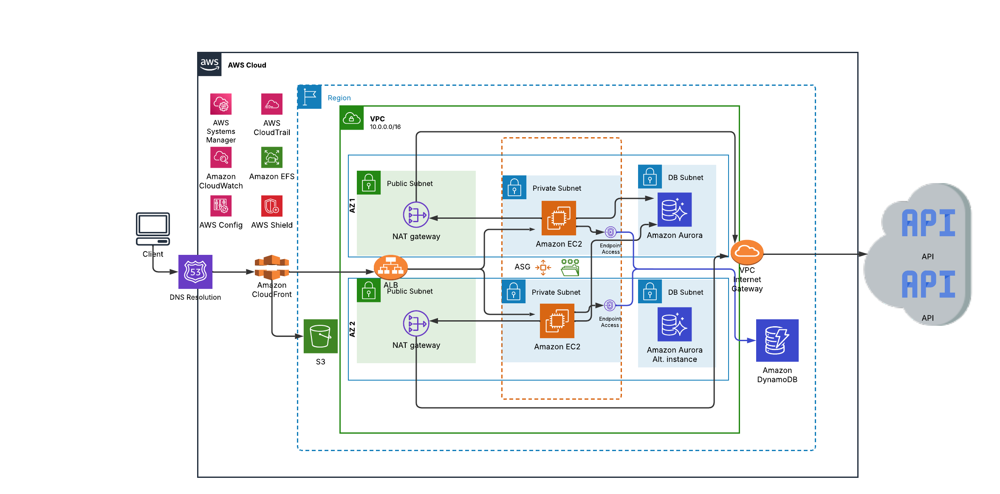

# Requerimientos:

- Se trabajará con AWS como proveedor Cloud para desplegar la aplicación.
- La aplicación cuenta con dos componentes fundamentales: un frontend y un backend que consume 2 microservicios externos y 2 bases de datos (una relacional y otra no relacional).
- El frontend está desarrollado con un framework de JS.
- El diseño debe soportar:
    - Cargas variables.
    - Contar con HA (alta disponibilidad)

## Solución realizada:

- Ya que no se especifica, la solución se basa en un diseño CSR (Client Side Rendering), por esto mismo se utilizan solo 2 instancias EC2 para el procesamiento del backend. En caso de necesitar un diseño SSR (Server Side Rendering) Podríamos utilizar 4 instancias EC2 (mayor carga de procesamiento), 2 para el frontend y 2 para el backend (depende el tráfico).

- Utiliza una arquitectura Multi-AZ, en este caso las aplicaciones operan en dos AZs dentro de una sola Región de AWS. Esto permite que la aplicación soporte impactos a nivel de AZ, lo cual brinda mejoras en disponibilidad, redundancia y escalabilidad.

- Cuando el cliente envía una request se utiliza **Route 53** como servidor de DNS, lo usamos para crear y administrar un nombre de dominio. Luego la solicitud llega a **Cloudfront**, que es una CDN. Segun el dominio, Cloudfront redirigirá la petición al bucket S3 (de donde se servirá el contenido estático del frontend) o al Application Load Balancer (ALB) que distribuirá la solicitud a las instancias EC2 del backend.

- El ALB es el que se encarga de distribuir el tráfico a las 2 instancias EC2 que se encuentran en AZ1 y AZ2. Para poder trabajar con cargas variables se emplea un Auto Scaling Group (ASG) que, en función de la demanda o ante posibles fallos nos permitirá tener una escalabilidad horizontal en nuestras instancias EC2 y mayor elasticidad.

- Los EC2 acceden a dos bases de datos, una relacional y una no relacional:

    - Aurora (base de datos relacional): esta es una base de datos relacional completamente administrada, altamentente disponible y de alto rendimiento. Es una buena opción dependiendo el tráfico que tengamos, ya que es una opción mas costosa que RDS, en momentos de mucha demanda la relación costo/perfomance de Aurora es superior. Si la demanda promedio es baja lo mejor sería optar por utilizar RDS. Para garantizar alta disponibilidad en caso de fallos Aurora se replica automaticamente en multiples AZ.

    - DynamoDB (base de datos no relacional): Es una base de datos NoSQL, completamente administrada y serverless, por lo que escala a demanda. Para acceder a DynamoDb utilizaremos el Gateway Endpoint que se encuentra en cada AZ.

- Para poder acceder a los microservicios externos se utilizan NAT Gateways que se encuentran en la subnet pública de cada AZ, lo cual permite que nuestras instancias backend accedan a internet de forma segura. Se optó por tener una NAT en cada AZ para que en caso de fallo de un AZ se pueda seguir teniendo disponibilidad de acceso.

## Servicios poco mencionados o no mencionados.

- AWS S3: es un servicio de almacenamiento de archivos, en nuestro caso almacena y sirve nuestro contenido estático. tambien podría utilizarse para almacenar backups o logs.

- AWS Systems Manager: Es un administrador de nodos que nos permite instalar agentes en nuestros equipos, esto nos permite entender el estado operacional de nuestros recursos y actuar en consecuencia.

- AWS CloudWatch: Agente de monitoreo que nos permite ver en tableros de control el estado operativo de nuestra arquitectura. Tambien se puede usar CloudWatch Alarms, que nos alerta cuando sobrepasamos algun umbral operacional que predefinamos.

- AWS CloudTrail: Es un servicio de trazabilidad que nos informa cuando se realizan cambios en nuestra infraestructura.

- AWS EFS (Elastic File System): Es un servicio de almacenamiento de archivos completamente administrado y escalable que nos permite que ambas instancias EC2 accedan al mismo File System.

- AWS Config: Es un servicio que nos permite evaluar las configuraciones de nuestros recursos, monitoreandolos continuamente.

- AWS Shield: Es un servicio de protección contra ataques DDoS que protege nuestra aplicación, tiene un modo de protección continuo con mitigaciones automáticas.

- AWS WAF: Es un Firewall que prote nuestra aplicación web contra ataques comunes.

## Referencias

https://aws.amazon.com/es/microservices/
