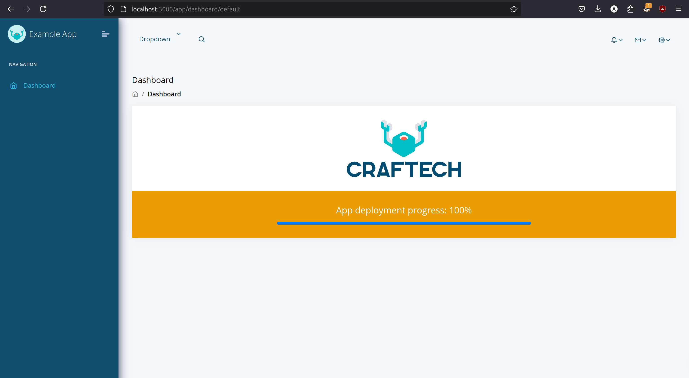

# Prueba 2 - Despliegue de una aplicación Django y React.js

## Requisitos
- Tener instalado:
    - Docker
    - Docker compose
    - Git

# Instrucciones para el lanzamiento de la app

## Lanzamiento local

1. Clonar el repositorio del proyecto:

        git clone https://github.com/AgustinFO/prueba-tec-craftech.git

2. Acceder al directorio donde se encuentra la app:

        cd prueba-tec-craftech/prueba2

3. Utilizamos docker compose para construir las imagenes y levantar los servicios.

        docker compose up --build
        o
        docker-compose up --build

4. Acceder al proyecto:

        http://localhost:3000/

## Lanzamiento en AWS

0. Primero nos registramos y logueamos en https://aws.amazon.com/.

1. Creamos una instancia EC2. Es importante tener cuidado, utilizaremos servicios elegibles en el free tier.

    - Seleccionamos "Launch Instance"

    - Se debe elegir una AMI, en mi caso elegí Amazon Linux 2.

    - Seleccionamos una instancia, la t2.micro es la unica disponible en free tier.

    - Configuramos un key pair (nos descargará un .pem)

    - Configuramos las opciones de red para poder acceder.

    - Configuramos el storage, en mi caso utilizo 8 gb de gp3.

    - Finalizamos nuevamente con "Launch instance".

2. Nos conectamos a la Instancia a través de SSH.

    - Primero vamos a cambiar los permisos de nuestro archivo .pem generado anteriormente, de esta manera estará protegido.

            chmod 400 test.pem

    - Ahora si, nos conectamos a nuestra instancia utilizando nuestro .pem y la DNS IPv4 pública de nuestra instancia.

            ssh -i "test.pem" ec2-user@ec2-54-165-134-135.compute-1.amazonaws.com

3. Instalamos el software necesario

    - En este caso vamos a instalar Git, Docker y Docker Compose. Ejecutar los siguientes comandos en orden.

    - Docker y Docker compose:

            sudo yum update -y 

            sudo amazon-linux-extras install docker -y

            sudo service docker start

            sudo usermod -a -G docker $USER

            nwgrp docker

            sudo curl -L "https://github.com/docker/compose/releases/latest/download/docker-compose-$(uname -s)-$(uname -m)" -o /usr/local/bin/docker-compose

            sudo chmod +x /usr/local/bin/docker-compose

        - Analizamos si se instaló correctamente.

                 docker-compose --version
    
    - Git:

            sudo yum install git -y

        - Analizamos si se instaló correctamente.

                git --version

4. Clonamos el repositorio del proyecto:

        git clone https://github.com/AgustinFO/prueba-tec-craftech.git

5. Acceder al directorio donde se encuentra la app:

        cd prueba-tec-craftech/prueba2

6. Utilizamos docker compose para levantar los servicios:

        docker-compose up --build

### Felicitaciones, ahora sabes como hacer un deploy!

## Referencias:

https://www.youtube.com/watch?v=gRgdnHHuvoI&t=522s

## Detalles:

Elegi usar AWS porque quería familiarizarme con los servicios que provee y su interfaz, ofrece una capa de servicios que son free tier además es el partner de la empresa.

Para definir y administrar los distintos servicios de la app elegí usar Docker Compose, ya que es con el que me encuentro mas familiarizado y, al ser un proyecto pequeño no es necesario usar por ejemplo Kubernetes. En caso de trabajar en un entorno de producción lo óptimo sería optar por trabajar con una EKS.